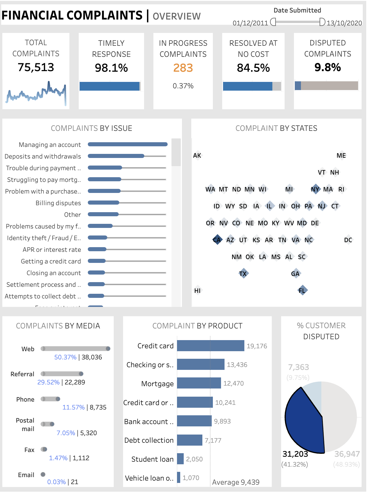

# Financial-Complaint-dashboard
This project constructs an insightful visual representation of consumer complaints, offering an in-depth analysis of their current status, submission channels, geographical distribution, complaints by issues, and product categories that the complaint is related to. This tool assists management in understanding and addressing consumer concerns effectively.

Data Source: https://data.world/markbradbourne/rwfd-real-world-fake-data/workspace/file?filename=Financial+Consumer+Complaints.csv

Tools used: Tableau

Visualization:

Link to Dashboard: https://public.tableau.com/views/FinancialComplaints_17101918725860/FCOverview?:language=en-GB&publish=yes&:sid=&:display_count=n&:origin=viz_share_link